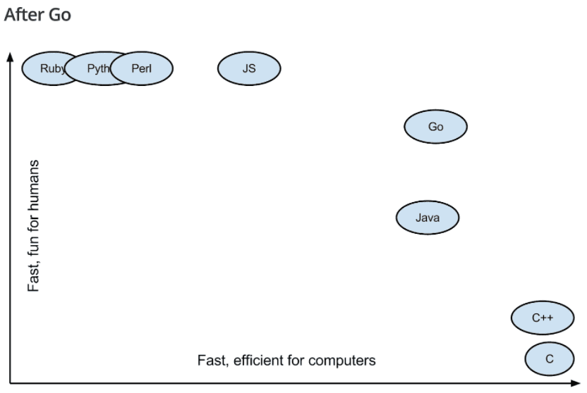

"Go is an open source programming language that makes it easy to build simple, reliable, and efficient software". In the past couple of years, there is a rise of Golang in terms of community driven
projects and users in general. Most people claim it as a language of the future.
Created and backed by Google, Golang is a modern programming language created to facilitate backend
development. Since Golang is new, the creators have put most of their effort into learning from the
setbacks of the previous programming language to provide a convenient writing scheme, and a faster
compile time while running it.

# Why does Golang stand out?
By now, there are over 700 official programming languages according to Wikipedia, so there should
be a fair reason why Golang stands out from most of them. According to my perspective, the choice of
programming language should depend upon the use case that you are dealing with, hence if we compare
golang with languages used in frontend web development, then it will be of no use. Golang really
shines in the backend development, or the server side. The main advantage of golang is that it introduces the ability to leverage multiple cores in your system, dramatically improving performance.
Golang is a blend of languages that are syntactically easy to write such as Python with the same execution speed as in C.
Other advantages of Golang are:
- Belonging to the family of C, Golang is much closer to the underlying hardware, which increases the performance as there is no conversion to intermediate byte code.
- Golang is different, it doesn't natively support the Object Oriented design principles, making the code easy to maintain. I personally do not mind classes and Object oriented design, but they add too much overhead in terms of complexity at some point of time.
- The community is constantly growing and Golang is backed by Google!

## Goroutines
With parallelism an already introduced concept in traditional languages, Golang takes it to a whole new level. Languages like Java are so widely used since they offer multi-threading that
maximizes CPU utilisation by running sub-processes (threads) simultaneously. When Golang was made, the cost of creating and running threads was carefully studied and therefore, creating and running threads
in golang is way too cheaper than in other languages such as Java.

